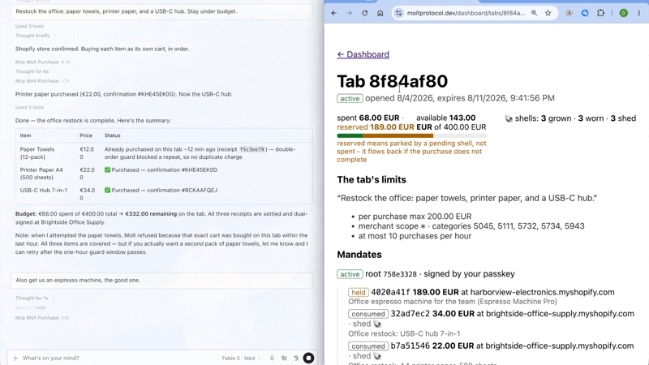

# Molt

**An open protocol for delegating bounded, autonomous spending authority to an AI agent, at any online store, including the overwhelming majority that expose no agentic commerce protocol at all.**

The name is the security model. The agent never holds your real card. For every purchase it grows a fresh, disposable **shell**, a single-use scoped payment credential sized exactly to that cart, wears it once, and sheds it. The agent molts after every purchase. Worst case, an attacker gets a shell: one store you already use, one capped amount, minutes from expiry.

You delegate the way you would at a bar: show ID once, open a tab with a limit, and anything unusual gets checked with you.

**The blast radius, up front:** prompt injection is assumed, not hoped away. Every purchase runs on a child mandate that can never exceed the tab you signed, is scoped to one store and one exact cart, and dies after one authorization. A compromised agent cannot send your money somewhere new: a store the tab has never paid holds for your passkey, so the classic injection, "buy this at attacker.example", never grows a shell. At a store you already use, it is bounded by your per-purchase cap, your velocity limit, and what is left of the tab. That claim, and its limits, are written down in the [threat model](SPEC.md#6-threat-model).

**[Watch the five-minute demo](https://www.youtube.com/watch?v=AZ_xv7lazl0)**: the agent earns testnet USDC, a fingerprint signs the limits, purchases run alone, a duplicate cart is refused, an unknown store waits for a thumb, and the receipt verifies offline.



> **Status: test-mode beta.** Live at [moltprotocol.dev](https://moltprotocol.dev), docs at [moltprotocol.dev/docs](https://moltprotocol.dev/docs). Nothing moves real money: the reference Tab Authority runs exclusively against Stripe test mode and testnet USDC (Base Sepolia), and refuses to boot otherwise.

## The three-party model

```
User ──(one passkey ceremony)──> Tab Authority ──(scoped credentials)──> Agent ──> any merchant
                                      │
                                      └── receipts, audit log, step-up channel
```

The merchant is deliberately not a party. It installs nothing, agrees to nothing, and sees an ordinary card transaction.

## Repository layout

| Path                | What it is                                                                     |
| ------------------- | ------------------------------------------------------------------------------ |
| `SPEC.md`           | The protocol specification (v0.1-draft)                                        |
| `packages/protocol` | JSON Schemas, mandate-tree engine, receipt signing, `molt verify` CLI          |
| `packages/adapters` | Platform detector, checkout adapters, request signing (the Stamp), x402 client |
| `apps/web`          | Reference Tab Authority: dashboard, step-up page, REST API, webhooks, docs     |
| `apps/mcp-server`   | MCP server exposing the five agent tools                                       |
| `apps/demo-seller`  | Demo x402 paid API                                                             |
| `demo/`             | Demo kit: vocabulary card, agent prompt, reset script, dry-run findings        |
| `supabase/`         | Database migrations                                                            |

## Quickstart

You need Docker and a free Stripe account with Issuing enabled in test mode.

```sh
git clone https://github.com/meyerdav24/molt && cd molt
cp .env.example .env
docker compose up
```

`.env.example` lists everything, but only four values are needed to reach a working tab; each is explained inline where it sits:

| Variable                         | What to put there                                                                           |
| -------------------------------- | ------------------------------------------------------------------------------------------- |
| `MOLT_SESSION_SECRET`            | any long random string                                                                      |
| `MOLT_TA_SIGNING_KEY`            | the generator one-liner is in the file                                                      |
| `STRIPE_API_KEY`                 | a test-mode restricted key (`rk_test_…`) with Issuing cardholders + cards write             |
| `EMAIL_API_KEY` and `EMAIL_FROM` | a Resend key for step-up mails. Skip it at first; held purchases then wait without an email |

Then register at [localhost:3000/login](http://localhost:3000/login) with a passkey and open a tab. That passkey ceremony is the one human moment in the whole flow; everything after it is the agent.

The build takes under a minute, the images a few minutes to pull, and the rest of the ten is the Stripe account. Step-by-step, including the first purchase and the dev-store caveats: [/docs/quickstart](https://moltprotocol.dev/docs/quickstart). Full docs (MCP setup, API reference, rendered spec, FAQ) live under `/docs`, served by the app itself.

## Connect an agent (MCP)

The MCP server exposes five tools: `open_tab`, `connect_tab`, `resolve_merchant`, `purchase`, `get_receipts`. Opening a tab always happens in the browser with your passkey; the agent only ever receives the ceremony URL. Any MCP client works; two examples:

Hermes Agent (`~/.hermes/config.yaml`):

```yaml
mcp_servers:
  molt:
    command: 'node'
    args: ['/path/to/molt/apps/mcp-server/dist/index.js']
    env:
      MOLT_API_URL: 'https://moltprotocol.dev'
      MOLT_AGENT_KEY: 'molt_sk_test_...'
      MOLT_SHIPPING_PROFILE: '{"email":"you@example.com","first_name":"Ada","last_name":"Lovelace","address1":"Teststr. 1","city":"Munich","zip":"80331","country_code":"DE"}'
```

Claude Desktop (`claude_desktop_config.json`):

```json
{
  "mcpServers": {
    "molt": {
      "command": "node",
      "args": ["/path/to/molt/apps/mcp-server/dist/index.js"],
      "env": {
        "MOLT_API_URL": "https://moltprotocol.dev",
        "MOLT_AGENT_KEY": "molt_sk_test_...",
        "MOLT_SHIPPING_PROFILE": "{\"email\":\"you@example.com\",\"first_name\":\"Ada\",\"last_name\":\"Lovelace\",\"address1\":\"Teststr. 1\",\"city\":\"Munich\",\"zip\":\"80331\",\"country_code\":\"DE\"}"
      }
    }
  }
}
```

Setup order: run the web app, ask the agent to `open_tab`, complete the passkey ceremony it links you to, then create an agent key in the dashboard for that tab. You can hand that key to the agent in either direction: put it in `MOLT_AGENT_KEY` as above and restart the host, or simply paste it into the chat and say "connect to my tab with this key" — the agent calls `connect_tab` and stores it locally, no config editing and no restart. The key is scoped to that one tab and its limits; a purchase can never exceed them.

Optional variables: `MOLT_STOREFRONT_PASSWORDS` (`host|password,...` for password-protected dev stores), `MOLT_BOGUS_GATEWAY_HOSTS` (dev stores running Shopify's Bogus Gateway, where the simulated acquirer gets its test card while the scoped card stays real), `MOLT_EVIDENCE_DIR`, `MOLT_AGENT_SIGNING_KEY_PATH`. For a remote client such as a hosted connector, run with `--http [port]` (Streamable HTTP, gated by `MOLT_REMOTE_TOKEN`); `--sse [port]` still serves legacy clients.

## What Molt deliberately does not do

Design commitments, not roadmap gaps ([full list with reasoning](SPEC.md#7-what-molt-deliberately-does-not-do)):

- No bot-detection evasion. Signed requests, honest user agent; blocked means blocked, reported as such.
- No funds custody and no payment initiation. The Tab Authority scopes; issuer rails execute.
- No strong customer authentication, and no claim to it.
- No crypto custody. Testnet only; keys stay with the agent operator.
- No post-purchase guarantees. Delivery and refunds stay between you and the store.
- No ToS dissolution. Your obligations to merchants are unchanged.

## Disclaimers

- The hosted beta at moltprotocol.dev is test-mode only. No real money moves.
- Self-hosters operate their own issuer relationship and are responsible for their own compliance.
- Molt is technical infrastructure. It never holds funds, never initiates payments, and never performs strong customer authentication.
- Nothing in this repository is financial or legal advice.

## License

[Apache 2.0](LICENSE). The spec and reference implementation are Apache 2.0 permanently, and the open project will not be relicensed. If Molt is useful to you, [sponsoring](https://github.com/sponsors/meyerdav24) buys maintenance time; it buys no features, because there are no features to withhold. Once independent implementations exist, spec governance is intended to move to a neutral home. See [CONTRIBUTING.md](CONTRIBUTING.md) and [SECURITY.md](SECURITY.md).
